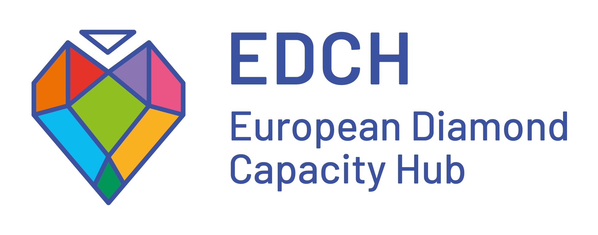

---
hide:
  - toc
---

# Mosar

Open model of support and guidance for journals

In November 2023, [MSH Mondes](https://www.mshmondes.cnrs.fr/){ target="_blank" rel="noopener" } launched the first scholarly publishing clinic in France. Inspired by the model of legal clinics, this innovative service offers free, tailored support to journals affiliated with institutions in its remit — [Paris 1 Panthéon-Sorbonne University](https://www.pantheonsorbonne.fr/){ target="_blank" rel="noopener" } and [Paris Nanterre University](https://www.parisnanterre.fr/){ target="_blank" rel="noopener" }.

  Illustration

<section class="home-section" markdown="1">

## Three questions

01

### Assess

How can we assess the scholarly journal landscape across a group of institutions?

02

### Support

How can we provide tailored support to help journals transition to diamond open access without requiring excessive resources?

03

### Share

How can we turn this approach into a model that can be reused nationally and across Europe?

</section>

<section class="home-section" markdown="1">

## Three stages

1

### Survey

Conduct a qualitative and quantitative survey to assess the journals, their practices and their needs within the MSH Mondes remit.

2

### Support

Based on this survey, select a group of journals for sustained support, developing a pathway that combines individual guidance with progress towards the [Diamond Open Access Standard (DOAS)](https://resources.edch.eu/fr/diamond-open-access-standard-doas).

3

### Develop a model

Formalise the range of services and make support tools available so that the approach can be replicated across France, particularly in cooperation with the [RnMSH](https://www.msh-reseau.fr/), and elsewhere in Europe.

</section>

<section class="home-section" markdown="1">

## Three deliverables

### :material-chart-box-outline: A landscape assessment

A report mapping the scholarly journal landscape at Paris 1 Panthéon-Sorbonne University and Paris Nanterre University.

### :material-account-group-outline: A range of support services

A comprehensive range of services for journals within the project remit: training, resources, and quantitative and qualitative indicators to document their development over time.

### :material-toolbox-outline: A toolkit

A trilingual toolkit designed to make the Mosar model and tools reusable in France and across Europe.

These deliverables will be accompanied by reflection on approaches to supporting scholarly journals, through a series of cross-professional meetings and a European conference comparing support schemes for the transition.

</section>

<section class="home-section home-fnso" markdown="1">

  <a href="https://www.ouvrirlascience.fr/le-fonds-national-pour-la-science-ouverte/" target="_blank" rel="noopener" aria-label="Fonds national pour la science ouverte">
    FNSO
  </a>

## A project supported by the FNSO

The **French National Fund for Open Science (FNSO)** is the funding mechanism of the [French National Plan for Open Science](https://www.ouvrirlascience.fr/deuxieme-plan-national-pour-la-science-ouverte/). It provides financial support for projects and initiatives advancing open science, particularly open scholarly publishing.

**Mosar** was selected for funding under the **fourth call for projects** on open scholarly publishing. 
- Coordinating institution: CNRS – MSH Mondes 
- Partners: EDCH (OPERAS), Paris Nanterre University, Paris 1 Panthéon-Sorbonne University

[>> Mosar project profile on Ouvrir la Science](https://www.ouvrirlascience.fr/mosar/){ target="_blank" rel="noopener" }

</section>

<section class="home-section home-partners" markdown="1">

  
  
  
  

</section>

