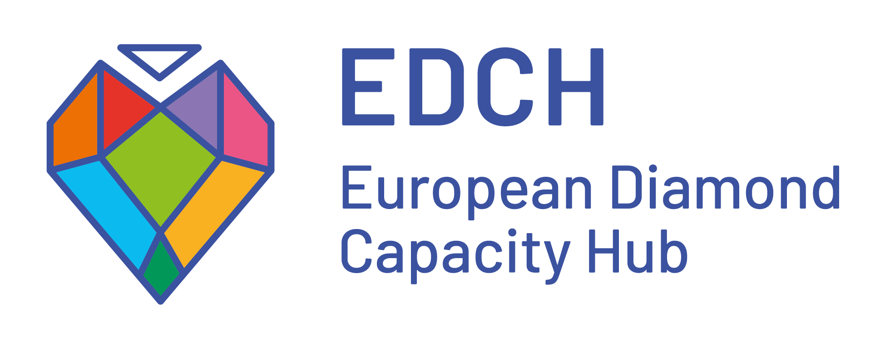

---
hide:
  - toc
---

# Projet Mosar

Modèle ouvert de soutien et d’accompagnement des revues

La [MSH Mondes](https://www.mshmondes.cnrs.fr/){ target="_blank" rel="noopener" } a inauguré en novembre 2023 la première clinique éditoriale en France. Ce service innovant propose aux revues de son périmètre — [université Paris 1 Panthéon-Sorbonne](https://www.pantheonsorbonne.fr/){ target="_blank" rel="noopener" } et [université Paris Nanterre](https://www.parisnanterre.fr/){ target="_blank" rel="noopener" } — un accompagnement sur mesure et gratuit, inspiré par le modèle des cliniques juridiques.

  Illustration Mosar

<section class="home-section" markdown="1">

## Trois questions

01

### Observer

Comment dresser un état des lieux des revues d’un site ?

02

### Accompagner

Comment accompagner les revues d’un site vers l’accès ouvert diamant d’une façon individualisée et sans moyens excessifs ?

03

### Transmettre

Comment monter en généralité pour rendre ce dispositif réutilisable au niveau national et européen ?

</section>

<section class="home-section" markdown="1">

## Le projet en trois temps

1

### Enquêter

Réaliser une enquête qualitative et quantitative dressant un état des lieux des revues, de leurs pratiques et de leurs besoins sur le périmètre de la MSH Mondes.

2

### Accompagner

À partir de cette enquête, sélectionner un panel de 20 revues à accompagner sur la durée et créer un parcours conciliant suivi individualisé et progression vers les standards de l’accès ouvert diamant (DOAS).

3

### Modéliser

Formaliser l’offre de services et mettre à disposition les outils d’accompagnement afin de rendre le dispositif réutilisable au niveau national, notamment en lien avec le RnMSH, et européen.

</section>

<section class="home-section" markdown="1">

## Trois livrables

### :material-chart-box-outline: Un état des lieux

Un rapport décrivant le paysage éditorial des revues de Paris 1 et Paris Nanterre.

### :material-account-group-outline: Une offre de services

Une offre complète destinée aux 186 revues du périmètre : formations, ressources et indicateurs quantitatifs et qualitatifs permettant de documenter les trajectoires d’évolution.

### :material-toolbox-outline: Un toolkit

Un toolkit trilingue destiné à rendre réutilisables le modèle et les outils de Mosar en France et en Europe.

Ces livrables seront associés à une réflexion sur la pratique de l’accompagnement des revues, qui se traduira par un cycle de rencontres interprofessionnelles et un colloque européen comparant les dispositifs de soutien à la transition.

</section>

<section class="home-section home-fnso" markdown="1">

  <a href="https://www.ouvrirlascience.fr/le-fonds-national-pour-la-science-ouverte/" target="_blank" rel="noopener" aria-label="Fonds national pour la science ouverte">
    FNSO
  </a>

## Un projet soutenu par le FNSO

Le **Fonds national pour la science ouverte (FNSO)** est l’instrument financier du Plan national pour la science ouverte. Il soutient des projets et des initiatives qui contribuent au développement de la science ouverte, notamment dans le domaine de la publication et de l’édition scientifiques ouvertes.

Mosar est **lauréat du quatrième appel à projets du FNSO en faveur de l’édition scientifique ouverte**. Porté par le CNRS – MSH Mondes avec ses partenaires, le projet est financé pour une durée de 24 mois afin de consolider la clinique éditoriale, accompagner les revues vers l’accès ouvert diamant et rendre le modèle transférable.

[Découvrir la fiche du projet Mosar sur Ouvrir la Science](https://www.ouvrirlascience.fr/mosar/){ target="_blank" rel="noopener" }

</section>

<section class="home-section home-partners" markdown="1">

## Partenaires

  
  
  
  

</section>

